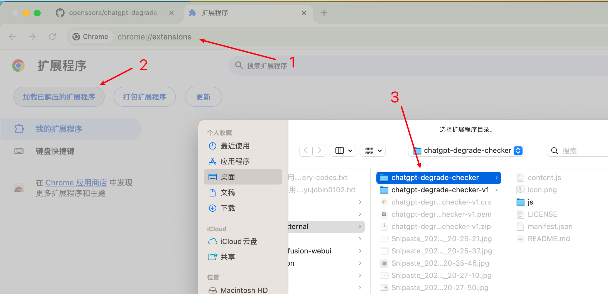

[@KoriIku](https://github.com/KoriIku) 已经开发了这个工具，但由于需要先安装 tampermonkey 再安装脚本的方式比较繁琐，所以我开发了这个Chrome扩展程序，方便小白使用。

## ChatGPT服务降级检测工具（Chrome扩展程序）
由于 ChatGPT 会对某些 IP 进行无提示的服务降级，此Chrome扩展程序用于检测你的 IP 是否被 ChatGPT 判定为高风险。在一定程度上可以用于辅助判断你的 IP 是否遭到服务降级。

## 安装及使用

1. 打开Chrome浏览器，输入：[chrome://extensions/](chrome://extensions/)
2. 导入扩展程序，选择 `chatgpt-degrade-checker` 文件夹即可

作为参考，这个值在超过 5 位时，一般代表你的ip较为优质，可以正常使用所有服务，如果小于等于 000032，说明你的 ip 被认为有很高的风险。

（更详细的区分尚不清晰，[@KoriIku](https://github.com/KoriIku) 简单测试了几个 ip，发现即便对同一个 ip，其要求的 PoW 也很容易变动，例如，如果已经完成了一个较困难的 PoW，下一次的 PoW 难度就会稍稍降低，但不会降低到“简单”级别。）

## 什么是服务降级？
ChatGPT 会对一些被判断为高风险的 IP 降级服务，偷偷将模型切换为 GPT-4o-mini 或者更差，并且没有任何提示。

## 服务降级有什么影响？
降级后，即便你是 Plus 用户，在使用 4o 模型时会发现无法使用联网搜索、图片生成等功能，使用 o1 模型时，会发现模型不进行思考直接回答。

## 特别致谢
- https://github.com/KoriIku/chatgpt-degrade-checker